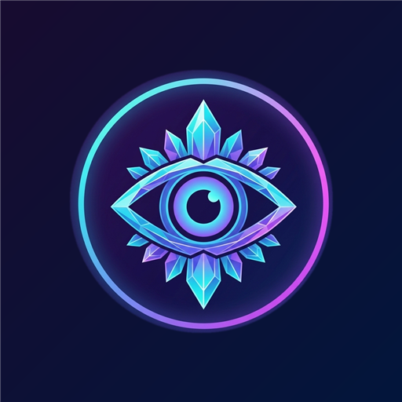

# 🌌 BLINK: Cosmic Observation

<p align="center">
  
</p>

<p align="center">
  <strong>"The World Changes When You Look Away."</strong>
</p>

<p align="center">
  
  
  
  
  
  
</p>

---

## 📖 Overview

**BLINK** is a high-fidelity, atmospheric cosmic observation and memory puzzle game built with Flutter. Guided by **Nova**, your celestial guide, players explore an expansive solar archipelago of floating islands, memorizing celestial relics, detecting cosmic shifts, and unlocking the mysteries of the universe.

Designed with an ultra-satisfying **2.5D tactile game feel**, neomorphic physics-based buttons, living procedural island bridges, and an interactive **3D Solar Orrery**, BLINK fuses mental engagement with tactile finger movement to create an addictive, meditative gaming experience.

---

## ✨ Key Features

### 🔭 1. The Cosmic Shift Observation Engine
- **Active Observation**: Memorize constellations, celestial artifacts, and ancient runes before closing your eyes.
- **The Shift**: When you blink, reality alters subtly. Spot the shifted, transformed, or inverted relics before cosmic energy destabilizes.
- **Streak Multipliers & Combos**: Chain perfect deductions to supercharge your score and earn celestial star gems.

### 🪐 2. Interactive Solar Archipelago & 3D Orrery
- **5 Planetary Realms**:
  1. **Verdant Astral (I)**: Emerald canopies, floating mossy crags, guided by *Chloris*.
  2. **Cosmic Crystal (II)**: Prismatic amethyst plateau, crystalline spires, guided by *Lumina*.
  3. **Solar Magma (III)**: Basalt cliffs and rivers of golden magma, guarded by *Ignis*.
  4. **Aetheria Clouds (IV)**: Celestial stratosphere and cloud skyways, navigated with *Zephyr*.
  5. **Starforge Omega (V)**: The quantum citadel Dyson Sphere, decoded alongside *Volt*.
- **3D Solar Orrery View**: Zoom out seamlessly from the archipelago surface to an interactive galaxy-scale solar system with rotating 3D planets orbiting the central **Solarium Sun**.
- **Living Island Architectures**:
  - 🏰 **Citadel Castles**: Milestone bastions with waving royal pennants and glowing portals.
  - 👽 **Alien Sanctuaries**: Perched living companions with breathing, blinking, and interactive lore dialogues.
  - 🔮 **Crystal Spires**: Resonance towers channeling realm energy.
  - 🌀 **Realm Gateways**: Wormholes connecting cosmic sectors.
- **Procedural Biome Bridges**: 5 custom-painted bridges connecting islands (Ancient Vines, Rainbow Lightbeams, Magma Basalt, Aether Nimbus, and Cyber Data Grids).

### 🕹️ 3. Physical 2.5D Tactile Game Feel
- **Realistic Push-Down Physics**: Buttons and islands displace downwards with authentic rim compression and specular light shifts on touch.
- **Haptic Vibration Feedback**: Tuned sensory pulses for light taps, confirmations, errors, and victory strikes.
- **Dead-Center Candy Top Bar**: Symmetrical neomorphic HUD with dead-centered profile medallion and adaptive compaction for narrow displays.

### 🎁 4. Retention & Meta Progression
- **Constellation Relics Codex**: Collect and examine 3D lore relics.
- **Mystery Portal**: Quantum shift challenges for bonus currencies and rare boosters.
- **Daily Cosmic Streaks**: Progressive rewards encouraging daily observation exercises.
- **Offline & Private**: Zero third-party trackers, zero forced video ads, 100% playable offline with local encrypted persistence.

---

## 🛠️ Architecture & Tech Stack

```
lib/
├── core/
│   ├── constants/       # Asset paths, routes, and audio keys
│   └── theme/           # AppColors, neomorphic shadows, typography
├── models/
│   ├── booster_model.dart
│   ├── lucky_spin_model.dart
│   ├── player_model.dart
│   └── solar_realm_model.dart  # Planetary realms, lore, and companion models
├── providers/           # Riverpod state providers
├── screens/
│   ├── home/            # Main menu with 3D diorama
│   ├── play/            # The observation gameplay arena
│   ├── world/           # Planetary Archipelago & Galaxy Orrery
│   ├── mystery/         # Mystery Portal minigame
│   └── profile/         # Player statistics and customization
├── services/            # Audio, haptics, notifications, and local storage
└── widgets/
    ├── navigation/      # CandyTopBar & GameBottomNav
    ├── tactile/         # TactileButton, TactilePill, and 2.5D physics
    └── world/           # BiomeBridgePainter, FloatingIslandWidget, SolarOrreryView
```

### Core Technologies
- **Framework**: [Flutter](https://flutter.dev) (v3.10+)
- **State Management**: [Riverpod 2.x](https://riverpod.dev)
- **Navigation**: [GoRouter](https://pub.dev/packages/go_router)
- **Audio & Haptics**: `audioplayers`, `vibration`
- **Typography**: Google Fonts (Outfit)
- **Rendering**: Custom procedural `CustomPainter` pipelines for bridges, castles, and globes

---

## 🚀 Getting Started

### Prerequisites
- Flutter SDK `^3.10.7`
- Android Studio / VS Code with Flutter extension
- JDK 17+ (for Android builds)

### Installation

1. **Clone the repository:**
   ```bash
   git clone https://github.com/Subrata0Ghosh/blink.git
   cd blink
   ```

2. **Install dependencies:**
   ```bash
   flutter pub get
   ```

3. **Run the test suite:**
   ```bash
   flutter test
   ```

4. **Launch locally on emulator or device:**
   ```bash
   flutter run
   ```

---

## 📦 Building for Production

### Android App Bundle (`.aab` for Google Play Console)
```bash
flutter build appbundle --release
```
*Output: `build/app/outputs/bundle/release/app-release.aab`*

### Release APK (`.apk` for Direct Testing / Sideloading)
```bash
flutter build apk --release
```
*Output: `build/app/outputs/flutter-apk/app-release.apk`*

### Direct ADB Installation
```bash
adb install -r build/app/outputs/flutter-apk/app-release.apk
```

---

## 🧪 Testing & Code Quality

BLINK maintains strict code quality and test coverage:
- **`flutter analyze`**: 0 warnings or lints.
- **`flutter test`**: **100+ comprehensive automated tests** covering:
  - Procedural biome bridges and canvas math
  - Island architectures, alien companions, and speech bubble layouts
  - Responsive top bar rendering down to 320px compact screens
  - Tactile 2.5D depression physics and button handlers

---

## 🔒 Privacy & Permissions

- **100% Private**: No user data collected or transmitted.
- **No Third-Party Analytics**: Fully standalone offline gameplay.
- **Standard Permissions**:
  - `VIBRATE`: Tactile physical tap response.
  - `POST_NOTIFICATIONS`: Local daily challenge reminders.

---

## 📄 License & Credits

Developed with ❤️ by **Technorchid**. All rights reserved.
For inquiries or support, refer to [PRIVACY_POLICY.md](PRIVACY_POLICY.md).
